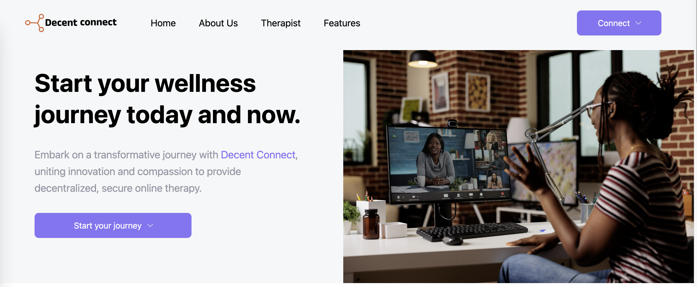

# 🩺 Decent Connect
> Decent Connect is a groundbreaking online therapy platform that meticulously verifies and onboards qualified therapists. It provides a trusted space for patients seeking mental health services. The platform ensures patient confidentiality, with only therapists having access to their data. Our mission is to facilitate a seamless and secure connection between therapists and individuals in need.

## 🪧 Problem statement
In response to the escalating demand for secure and decentralized mental health services, Decent Connect has emerged as an innovative solution to revolutionize the current landscape. The prevailing challenges in providing accessible yet confidential online therapy have inspired the creation of a transformative platform that seamlessly integrates innovation with compassion. Recognizing the critical need for a secure environment, we have designed Decent Connect to be the catalyst for a paradigm shift in mental well-being, addressing the pressing issues faced by individuals seeking confidential and reliable support.

## ⚙ Key features
Discover the empowering capabilities of our application, designed to redefine the mental health experience:

- **Profile Creation:**
Effortlessly create and curate profiles tailored to your unique identity, whether you're a therapist, patient, or organization. Manage your presence on the platform with ease.

- **Therapist Command Center:**
Empower therapists with a dedicated dashboard, granting them a panoramic view of incoming requests from onboarded patients. Facilitate streamlined communication and effective patient management.

- **Organization Oversight:**
Organizations play a pivotal role in maintaining the integrity of our platform. Our system ensures thorough verification of therapists, guaranteeing credibility and qualifications for a trusted therapeutic environment.

- **Appointment Harmony:**
Revolutionize the way doctors manage appointments. Seamlessly handle bookings, review recent appointments, and conduct video conferences, all within an integrated and efficient system.

- **Fortified Medical Records:**
Grant therapists the capability to securely compose and manage medical records directly within the platform. Enhance the privacy and security of sensitive patient information.

- **Patient-Centric Booking:**
Foster a patient-centric approach by providing a user-friendly platform for patients to effortlessly book appointments with their preferred doctors. Simplify the journey to mental well-being.

- **Transparent Medical Records Access:**
Uphold transparency and convenience by enabling patients to effortlessly access and review their medical records. Empower individuals with insights into their mental health journey.

## 🚦 Getting Started
To get a local copy up and running, follow these steps.
### Prerequisites
To run this project you need:

- Node.js and npm:
Ensure that Node.js, a JavaScript runtime, is installed on your machine.
npm (Node Package Manager) is typically included with Node.js.

- Text Editor:
Choose a preferred text editor for code editing. Popular choices include Visual Studio Code, Sublime Text, or Atom.

- Web Browser:
Have a modern web browser installed (e.g., Google Chrome, Mozilla Firefox, or Microsoft Edge) to launch and interact with the application.

## 🗝️ Set up

Step 1: Clone this repository to your desired path:
```
git clone https://github.com/Chrissiku/decent-connect.git
```

Step 2: Change the directory (dir) to decent-connect path
```
cd decent connect
```

Step 3: Install all the required dependencies (using npm in our case)
```
npm install
```

Step 4: Run the project locally by starting the server
```
npm run dev
``` 

## 🎲 Configuration

To ensure optimal functionality of the application, create a `.env` file in the root of your repository and add the following variables:

```
VITE_PUBLIC_DID=EiBtig...zdSVm5LWUZBIn19
VITE_PROTOCOL_URL=myProtocolUrl
VITE_ZEGOCLOUD_APP_ID=1033669453xx
VITE_ZEGOCLOUD_SERVER_SECRET=83f361bcdfc073d076636b4f4b8d37ffxx
```

**Note:** 
To generate a token for `VITE_PUBLIC_DID`, navigate to `context/ContextProvider.jsx` file and add the `console.log(did)` statement at the end of the `useEffect` where the `did` is set.
Generate the token from the browser console, and paste the token into your variable.

## 🌎 Deployment

To run the application in a production environment, you can access the live version using the following URL:
- [decent connect](https://decent-connect.vercel.app/)


## 👥 Contributors

- **👤 Gina Beki**
- **👤 Christian Siku**

## 🪪 License
This project is licensed under the [MIT License](LICENSE) - see the [LICENSE](LICENSE) file for details.